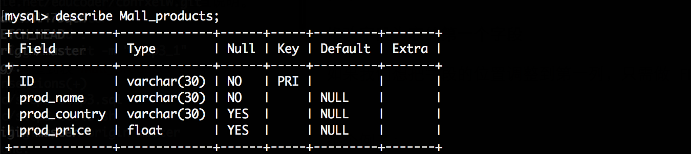
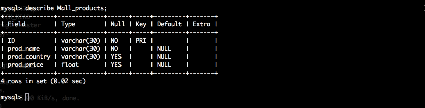
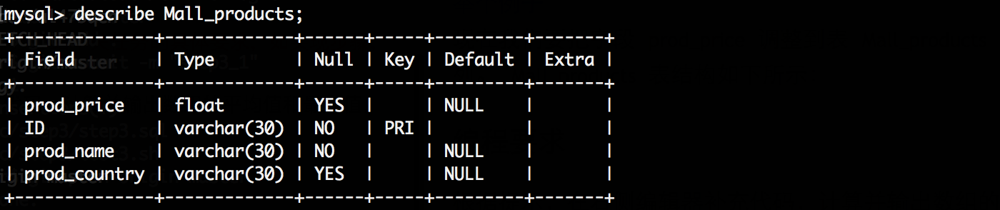
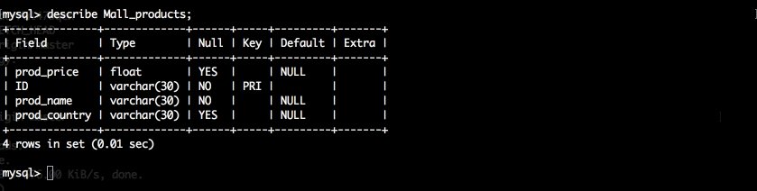
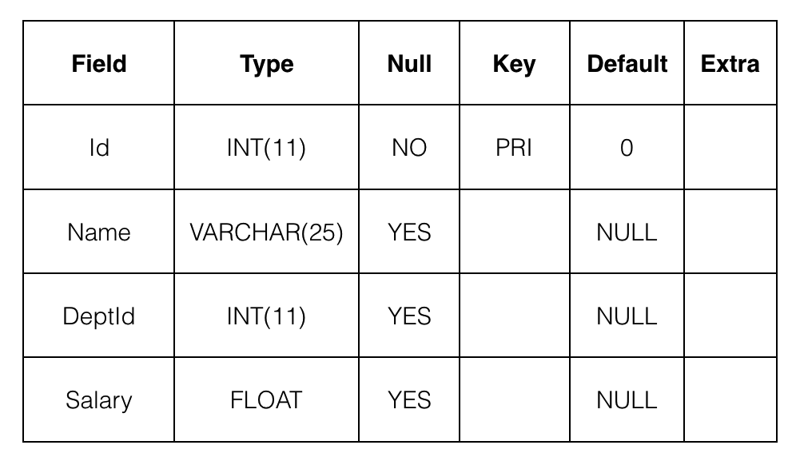

- [任务描述](#任务描述)
- [相关知识](#相关知识)
- [修改字段的排列位置](#修改字段的排列位置)
  - [举个例子](#举个例子)
- [修改字段到表的指定列之后](#修改字段到表的指定列之后)
  - [举个例子](#举个例子-1)
- [编程要求](#编程要求)

### 任务描述

本关任务：修改表中某字段的顺序，分别将其排至表中的第一列与指定列之后。

### 相关知识

为了完成本关任务，你需要掌握：如何将某字段排至表中的指定位置。

### 修改字段的排列位置

在一个数据表被创建的时候，其字段的排列顺序就已被确定了。不能变了吗？怎么可能，一锤子买卖没人敢做。

我们可以通过 `ALTER TABLE` 来改变表中字段的相对位置。

语法规则为： `ALTER TABLE 表名 MODIFY 字段1 数据类型 FIRST|AFTER 字段2; `。

其中，字段1指要修改位置的字段， `FIRST` 与 `AFTER` 字段2为可选参数。

修改字段为表的第一个字段

如果我们想把字段的位置调整到第一列，只需做 `FIRST` 的位置说明。

#### 举个例子

现在我们要把字段 `prod_price` 调整到表 `Mall_products` 的第一列。 `Mall_products` 表结构如下所示：

输入命令：
`ALTER TABLE Mall_products MODIFY prod_price FLOAT FIRST;
`
执行过程如下所示：

### 修改字段到表的指定列之后

还有一种位置调整的方法可以让你把想调整的字段放在除了第一列的任何位置。调整的时候需要做AFTER 字段2的位置说明。

#### 举个例子

现在我们要把字段 `prod_price` 调整到字段 `prod_country` 的后面。 `Mall_products` 表结构如下所示：

输入命令：
ALTER TABLE Mall_products MODIFY prod_price FLOAT AFTER prod_country;

执行过程如下所示：

调整成功！

接下来你们可以自行体验一下了！

### 编程要求

根据提示，在右侧编辑器补充代码:

将数据表 `tb_emp` 的 `Name` 字段移至第一列，数据格式不变；

将 `DeptId` 字段移至 `Salary` 字段的后边，数据格式不变。

数据表结构如下:

