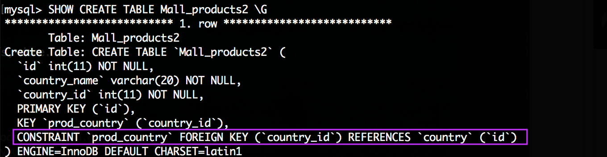

### 任务描述

本关任务：删除表中的外键约束。

### 相关知识

为了完成本关任务，你需要掌握：如何删除表的外键约束

### 删除表的外键约束

我们曾在第一章中讲过外键的作用，以及如何创建一个表的外键。建立了外键我们就建立起了两张表的关联关系，那如果我想删除主表呢？为了确保数据库的正确性，我们必须先解除两个表之间的关联关系，那就是删除外键约束啦！让我们先来看看删除外键约束的语法规则。

语法规则为： `ALTER TABLE 表名 DROP FOREIGN KEY 外键约束名;` 。

### 举个例子：

我们先建立了一个主表 `country` ，表结构如下图所示：


然后建立一个有外键约束的子表Mall_products2，让它的键country_id作为外键关联到country的主键id。SQL语句如下：

```sql
CREATE TABLE Mall_products2
(
    id INT(11) PRIMARY KEY,
    country_name VARCHAR(20) NOT NULL,
    country_id INT(11) NOT NULL,
    CONSTRAINT prod_country FOREIGN KEY(country_id) REFERENCES country(id)
)
```

上述语句成功执行后，在表Mall_products2上添加了名称为prod_country的外键约束，外键名称为prod_country，依赖于表country的主键id，从下图中可以看到，已经成功添加了表的外键：



`Mall_products2` 表结构如下图所示：


下面开始删除外键约束，语句如下：

`ALTER TABLE Mall_products2 DROP FOREIGN KEY prod_country;
`

使用 `SHOW CREATE TABLE` 查看表 Mall_products2 的结构，结果如下：


我们可以看到，`FOREIGN KEY` 不见了，外键约束删除成功！

接下来你们可以自行体验一下了！
