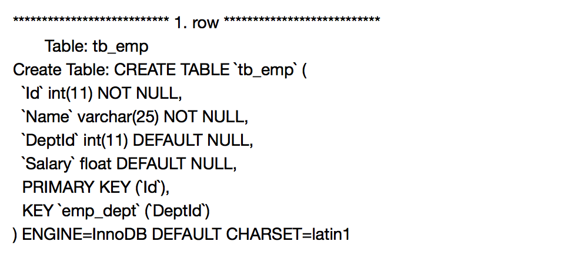

### 编程要求

我们已经为你建立了主表 `tb_dept` 和子表 `tb_emp`，在表 `tb_emp` 上添加了名称为 `emp_dept` 的外键约束，外键名称为 `DeptId`，依赖于表 `tb_dept` 的主键Id，下面那是两张表的结构展示：

请你根据提示，在右侧编辑器 `Begin-End` 中补充代码:

删除数据表 `tb_emp` 的外键约束 `emp_dept`。

### 测试说明

我会对你编写的代码进行测试，最终结果会如下图所示：

---

开始你的任务吧，祝你成功！
